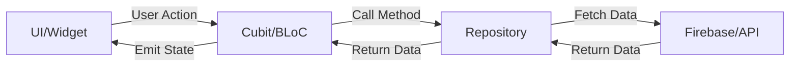

# 🩸 SehatApp - Blood Donation & Healthcare Platform

<div align="center">


**A modern, feature-rich Flutter application connecting blood donors with those in need**

[](https://flutter.dev)
[](https://firebase.google.com)
[](https://blog.cleancoder.com/uncle-bob/2012/08/13/the-clean-architecture.html)
[](https://bloclibrary.dev)

</div>

---

## 📱 Overview

**SehatApp** is a comprehensive healthcare platform designed to bridge the gap between blood donors and recipients. Built with Flutter and Firebase, it provides a seamless experience for managing blood donation requests, real-time communication, AI-powered assistance, and much more.

### 🎯 Key Highlights

-  **Clean Architecture** - Scalable, maintainable, and testable codebase
-  **Multi-language Support** - English, Hindi, Arabic, and Urdu
-  **Real-time Features** - Firebase Firestore & Realtime Database
-  **WebRTC Calling** - Audio and video calls
-  **AI Assistant** - Gemini-powered chat support
-  **Smart Notifications** - FCM with interactive actions
-  **Offline Support** - Works without internet connectivity
- **Comprehensive Testing** - Unit, widget, and integration tests

---

##  Features

### 1.  Authentication & Onboarding


**Secure and user-friendly authentication system**

- **Email/Password Authentication** - Firebase Auth integration
- **Google Sign-In** - One-tap social authentication
- **Interactive Onboarding** - Beautiful introduction screens with Lottie animations
- **Permissions Onboarding** - Guided permission requests for notifications, camera, microphone
- **Profile Setup** - Two-step profile creation with validation
- **Stay Logged In** - Persistent session management
- **Form Validation** - Real-time input validation with BLoC

**Technical Implementation:**
- `LoginCubit` & `SignupValidationCubit` for state management
- Firebase Authentication with error handling
- Shared Preferences for session persistence
- Custom validation logic for email, password, and phone numbers

---

### 2.  Dashboard


**Centralized hub for all blood donation activities**

- **Personalized Greeting** - Dynamic user name display
- **Donation Status Toggle** - Quick availability updates
- **Search Functionality** - Hero animation to search page
- **Banner Carousel** - Auto-scrolling promotional banners
- **Blood Group Filters** - Quick access to specific blood types (A+, B+, O+, AB+, etc.)
- **Recently Viewed** - Track previously viewed blood requests
- **Our Contribution** - Statistics showcase with beautiful cards
- **Recent Posts Feed** - Real-time blood request updates
- **Unread Notifications Badge** - Stay informed of new activities

**Technical Implementation:**
- `PostsCubit` for managing posts state
- `RecentlyViewedCubit` for tracking user interactions
- `NotificationCubit` for badge counts
- Firebase Firestore real-time listeners
- Shimmer loading effects
- Custom widgets: `DashboardHeader`, `BannerCarousel`, `BloodGroupChips`

---

### 3.  Search & Blood Request


**Powerful search and request creation system**

#### Search Features:
- **Advanced Filtering** - By blood group, location, date
- **Real-time Search** - Instant results as you type
- **Search History** - Recent searches saved locally
- **Location-based Search** - Find donors nearby
- **Date Range Filters** - Urgent vs. scheduled requests

#### Blood Request Features:
- **Create Requests** - Detailed form with validation
- **Request Details** - Comprehensive view with all information
- **Contact Options** - Call, message, or chat with donors
- **Share Requests** - Share via social media or messaging apps
- **Request Status** - Track active, fulfilled, or expired requests
- **Image Upload** - Attach medical documents or prescriptions

**Technical Implementation:**
- `BloodRequestCubit` for request management
- `SearchCubit` for search state and filtering
- Firebase Firestore queries with compound indexes
- Form validation with custom validators
- Image picker integration
- Deep linking support

---

### 4.  Real-time Chat & Messaging


**Seamless communication between donors and recipients**

- **One-on-One Chat** - Private messaging
- **Real-time Updates** - Instant message delivery
- **Read Receipts** - See when messages are read
- **Typing Indicators** - Know when someone is typing
- **Message Notifications** - Push notifications for new messages
- **Inline Reply** - Reply directly from notifications
- **Message History** - Persistent chat history
- **Inbox Management** - Organized conversation list
- **Unread Count Badges** - Never miss a message
- **Emoji Support** - Express yourself better

**Technical Implementation:**
- `ChatCubit` for chat state management
- Firebase Realtime Database for instant messaging
- `InboxCubit` for conversation management
- FCM for push notifications with reply actions
- Custom message widgets with animations
- Optimistic UI updates

---

### 5.  Audio & Video Calls


**WebRTC-powered calling system**

- **Audio Calls** - Crystal clear voice communication
- **Video Calls** - Face-to-face conversations
- **Call Notifications** - Incoming call alerts with ringtones
- **Call Controls** - Mute, speaker, camera toggle
- **Call History** - Track all calls
- **Background Calling** - Continue calls while using other apps
- **Network Quality Indicator** - Real-time connection status
- **Call Recording** - (Optional feature)

**Technical Implementation:**
- `CallCubit` for call state management
- `flutter_webrtc` for peer-to-peer connections
- Firebase Realtime Database for signaling
- `CallListener` widget for global call handling
- Custom ringtone player
- Permission handling for camera and microphone

---

### 6.  AI Assistant (Gemini Integration)


**Intelligent chatbot for healthcare queries**

- **Natural Language Processing** - Understand user queries
- **Health Information** - Get answers about blood donation
- **Markdown Support** - Rich formatted responses
- **Conversation History** - Review past interactions
- **Context Awareness** - Remember conversation context
- **Quick Suggestions** - Starter prompts for common questions
- **Typing Animation** - Engaging user experience
- **Error Handling** - Graceful fallbacks

**Technical Implementation:**
- `AIChatCubit` for managing AI chat state
- Google Gemini API integration
- `flutter_markdown` for rendering responses
- Environment variables for API key security
- Custom starter view with suggested prompts
- Streaming responses for real-time feel

---

### 7.  Smart Notifications


**Comprehensive notification system**

- **Push Notifications** - Firebase Cloud Messaging
- **Interactive Notifications** - Reply, Mark as Read actions
- **Notification Categories** - Posts, Messages, Calls, System
- **Notification History** - View all past notifications
- **Unread Badges** - Visual indicators
- **Notification Preferences** - Customize what you receive
- **Deep Linking** - Tap to navigate to relevant content
- **Background Handling** - Receive notifications when app is closed
- **Foreground Alerts** - In-app notification banners

**Technical Implementation:**
- `NotificationCubit` for state management
- `NotificationService` for FCM integration
- `flutter_local_notifications` for local notifications
- Custom notification payload handling
- Background message handlers
- Notification action handlers

---

### 8.  Settings & Profile


**Comprehensive user settings and profile management**

- **Profile Editing** - Update personal information
- **Language Selection** - Switch between 4 languages
- **Donation Preferences** - Set availability and preferences
- **Privacy Settings** - Control data sharing
- **Notification Settings** - Manage notification preferences
- **Account Management** - Delete account, logout
- **About & Help** - App information and support
- **Theme Toggle** - (Future feature)

**Technical Implementation:**
- `AppLocaleCubit` for language management
- Shared Preferences for settings persistence
- Firebase Auth for account management
- Custom settings widgets
- Localization with `flutter_localizations`

---

### 9.  Onboarding Experience


**Engaging first-time user experience**

- **Welcome Screens** - Beautiful introduction to app features
- **Lottie Animations** - Smooth, engaging animations
- **Skip Option** - Quick access for returning users
- **Progress Indicators** - Visual feedback on onboarding progress
- **Permissions Explanation** - Clear reasoning for permissions
- **Get Started CTA** - Smooth transition to authentication

**Technical Implementation:**
- Custom onboarding page with PageView
- Lottie animation integration
- Shared Preferences to track onboarding completion
- Smooth page transitions

---

### 10.  Additional Features

#### Network Status Management
- **Offline Detection** - Automatic network status monitoring
- **Offline Banner** - Visual indicator when offline
- **Retry Mechanism** - Automatic reconnection attempts
- **Offline Caching** - Firestore offline persistence
- **Queue Management** - Sync data when back online

#### Recently Viewed
- **View History** - Track viewed blood requests
- **Quick Access** - Easily revisit important requests
- **Preview Mode** - Dashboard shows limited items
- **Full History Page** - View all recently viewed items

#### Shell Navigation
- **Bottom Navigation** - Quick access to main sections
- **Tab Persistence** - Remember last visited tab
- **Badge Indicators** - Unread counts on tabs

---

##  Architecture

SehatApp follows **Clean Architecture** principles combined with **BLoC (Business Logic Component)** pattern for state management.

### Architecture Layers

```
lib/
├── core/                          # Core functionality
│   ├── config/                    # App configuration
│   ├── constants/                 # App-wide constants
│   ├── localization/              # Localization logic
│   ├── navigation/                # Navigation service
│   ├── network/                   # Network status management
│   ├── providers/                 # Global providers
│   ├── router/                    # GoRouter configuration
│   ├── theme/                     # App theming
│   └── widgets/                   # Reusable widgets
│
├── features/                      # Feature modules
│   ├── auth/                      # Authentication
│   │   ├── data/                  # Data layer (repositories)
│   │   ├── presentation/          # Presentation layer
│   │   │   ├── bloc/              # BLoC/Cubit
│   │   │   ├── pages/             # Screens
│   │   │   └── widgets/           # Feature-specific widgets
│   │
│   ├── dashboard/                 # Dashboard feature
│   ├── blood_request/             # Blood request feature
│   ├── chat/                      # Chat feature
│   ├── call/                      # Calling feature
│   ├── ai_chat/                   # AI assistant
│   ├── notification/              # Notifications
│   ├── profile/                   # User profile
│   ├── search/                    # Search functionality
│   └── ...                        # Other features
│
├── l10n/                          # Localization files
│   ├── app_en.arb                 # English
│   ├── app_hi.arb                 # Hindi
│   ├── app_ar.arb                 # Arabic
│   └── app_ur.arb                 # Urdu
│
└── main.dart                      # App entry point
```

### Design Patterns Used

#### 1. **Clean Architecture**
- **Separation of Concerns** - Each layer has a single responsibility
- **Dependency Rule** - Dependencies point inward
- **Testability** - Easy to test each layer independently

#### 2. **BLoC Pattern**
- **State Management** - Predictable state changes
- **Event-Driven** - React to user actions
- **Stream-Based** - Reactive programming
- **Separation** - UI separated from business logic

#### 3. **Repository Pattern**
- **Data Abstraction** - Abstract data sources
- **Single Source of Truth** - Centralized data management
- **Caching** - Local caching with Firestore offline persistence

#### 4. **Dependency Injection**
- **BlocProvider** - Provide BLoCs to widget tree
- **RepositoryProvider** - Inject repositories
- **Loose Coupling** - Easy to swap implementations

### State Management Flow



### Key Architectural Decisions

1. **Feature-First Organization** - Code organized by features, not layers
2. **BLoC for Complex State** - Cubits for simpler state management
3. **GoRouter for Navigation** - Type-safe, declarative routing
4. **Firebase Backend** - Real-time capabilities, authentication, storage
5. **Offline-First** - App works without internet connectivity
6. **Localization** - Multi-language support from the ground up
7. **Responsive Design** - `flutter_screenutil` for adaptive layouts

---

## Testing

SehatApp has comprehensive test coverage across multiple levels:

### Test Structure

```
test/
├── core/
│   └── network/
│       └── network_status_cubit_test.dart
├── features/
│   ├── auth/
│   │   └── bloc/
│   │       ├── login_validation_test.dart
│   │       └── signup_validation_cubit_test.dart
│   ├── blood_request/
│   │   └── bloc/
│   │       └── blood_request_cubit_test.dart
│   ├── call/
│   │   └── cubit/
│   │       └── call_cubit_test.dart
│   ├── chat/
│   │   └── cubit/
│   │       └── chat_cubit_test.dart
│   ├── notification/
│   │   └── cubit/
│   │       └── notification_cubit_test.dart
│   └── post_request/
│       └── bloc/
│           └── create_post_cubit_test.dart
└── widget_test.dart

integration_test/
└── app_test.dart
```

### Testing Levels

#### 1. **Unit Tests**
Testing individual functions, methods, and classes in isolation.

**Example: Login Validation Test**
```dart
test('should emit valid state when email and password are valid', () {
  // Arrange
  final cubit = LoginValidationCubit();
  
  // Act
  cubit.validateEmail('test@example.com');
  cubit.validatePassword('password123');
  
  // Assert
  expect(cubit.state.isValid, true);
});
```

**Coverage:**
-  Authentication validation logic
- Network status detection
- Data transformation functions
-  Utility functions

#### 2. **BLoC/Cubit Tests**
Testing state management logic using `bloc_test` package.

**Example: Notification Cubit Test**
```dart
blocTest<NotificationCubit, NotificationState>(
  'should increment unread count when notification received',
  build: () => NotificationCubit(mockRepository),
  act: (cubit) => cubit.onNotificationReceived(mockNotification),
  expect: () => [
    NotificationState(unreadCount: 1, notifications: [mockNotification]),
  ],
);
```

**Coverage:**
- `PostsCubit` - Post loading and filtering
- `ChatCubit` - Message sending and receiving
-  `CallCubit` - Call state management
- `NotificationCubit` - Notification handling
- `BloodRequestCubit` - Request creation and updates
- `CreatePostCubit` - Post creation flow
- `NetworkStatusCubit` - Network connectivity

#### 3. **Widget Tests**
Testing UI components and user interactions.

**Coverage:**
- Custom widgets render correctly
- User interactions trigger expected callbacks
- Conditional rendering based on state
- Navigation flows

#### 4. **Integration Tests**
End-to-end testing of complete user flows.

**Coverage:**
- Complete authentication flow
- Post creation and viewing
- Chat functionality
- Navigation between screens

### Running Tests

```bash
# Run all unit and widget tests
flutter test

# Run tests with coverage
flutter test --coverage

# Run integration tests
flutter test integration_test/app_test.dart

# Run specific test file
flutter test test/features/auth/bloc/login_validation_test.dart
```

### Mocking Strategy

- **Mockito** - For generating mocks
- **Mocktail** - For simpler mocking syntax
- **bloc_test** - For testing BLoCs/Cubits

**Example Mock:**
```dart
class MockPostRepository extends Mock implements PostRepository {}
class MockFirebaseAuth extends Mock implements FirebaseAuth {}
```

### Test Coverage Goals

- **Unit Tests**: 80%+ coverage
- **BLoC Tests**: 100% coverage for all Cubits
- **Widget Tests**: Critical user paths
- **Integration Tests**: Main user flows

---

##  Getting Started

### Prerequisites

- Flutter SDK (3.10.0 or higher)
- Dart SDK (3.10.0 or higher)
- Firebase account
- Android Studio / VS Code
- Xcode (for iOS development)

### Installation

1. **Clone the repository**
```bash
git clone https://github.com/yourusername/sehatapp.git
cd sehatapp
```

2. **Install dependencies**
```bash
flutter pub get
```

3. **Set up Firebase**
   
   >  **Important:** This project does not include Firebase configuration files for security reasons.
   
   You need to create your own Firebase project and configure it:
   
   - Copy the example file: `cp lib/firebase_options.dart.example lib/firebase_options.dart`
   - Follow the detailed instructions in [FIREBASE_SETUP.md](FIREBASE_SETUP.md)
   - Or use FlutterFire CLI for quick setup:
   ```bash
   flutterfire configure
   ```

4. **Set up environment variables**
   - Copy `.env.example` to `.env`
   ```bash
   cp .env.example .env
   ```
   - Add your Gemini API key (get it from [Google AI Studio](https://makersuite.google.com/app/apikey)):
   ```
   GEMINI_API_KEY=your_actual_api_key_here
   ```

5. **Generate launcher icons**
```bash
flutter pub run flutter_launcher_icons
```

6. **Run the app**
```bash
flutter run
```

### Firebase Configuration

>  **Important for Contributors:** You must set up your own Firebase project. This repository does not include Firebase configuration files for security reasons.

#### Quick Setup with FlutterFire CLI

The fastest way to configure Firebase:

```bash
# Install FlutterFire CLI
dart pub global activate flutterfire_cli

# Login to Firebase
firebase login

# Configure your project
flutterfire configure
```

This will automatically:
- Create/select a Firebase project
- Generate `lib/firebase_options.dart` with your configuration
- Download platform-specific config files

#### Manual Setup Steps

If you prefer manual setup or need more control:

1. **Create Firebase Project**
   - Go to [Firebase Console](https://console.firebase.google.com/)
   - Click "Add project" and follow the wizard
   - Enable Google Analytics (optional)

2. **Add Your Apps**
   - Add Android app with package name: `com.example.sehatapp`
   - Add iOS app with bundle ID: `com.example.sehatapp`
   - Download `google-services.json` → place in `android/app/`
   - Download `GoogleService-Info.plist` → place in `ios/Runner/`

3. **Copy Firebase Template**
   ```bash
   cp lib/firebase_options.dart.example lib/firebase_options.dart
   ```
   Then replace all `YOUR_*` placeholders with values from Firebase Console

4. **Enable Firebase Services**

   **Authentication:**
   - Go to Authentication → Get Started
   - Enable Email/Password sign-in
   - Enable Google sign-in
   - For Android: Add SHA-1 fingerprint (see below)

   **Firestore Database:**
   - Go to Firestore Database → Create Database
   - Start in production mode
   - Choose your region

   **Realtime Database:**
   - Go to Realtime Database → Create Database
   - Start in locked mode
   - Choose your region

   **Cloud Storage:**
   - Go to Storage → Get Started
   - Start in production mode

   **Cloud Messaging (FCM):**
   - Automatically enabled with Firebase
   - For iOS: Upload APNs certificate in Cloud Messaging settings

5. **Get SHA-1 Fingerprint (Required for Google Sign-In on Android)**

   Debug SHA-1:
   ```bash
   cd android
   ./gradlew signingReport
   ```
   
   Copy the SHA-1 from "Variant: debug" section, then:
   - Go to Firebase Console → Project Settings
   - Scroll to "Your apps" → Select Android app
   - Click "Add fingerprint" and paste SHA-1
   - Download updated `google-services.json`

#### Firebase Security Rules

After enabling services, set up security rules:

**Firestore Security Rules**

Go to Firestore Database → Rules and paste:

```javascript
rules_version = '2';
service cloud.firestore {
  match /databases/{database}/documents {
    match /users/{userId} {
      allow read: if request.auth != null;
      allow write: if request.auth.uid == userId;
    }
    
    match /posts/{postId} {
      allow read: if request.auth != null;
      allow create: if request.auth != null;
      allow update, delete: if request.auth.uid == resource.data.uid;
    }
    
    match /notifications/{notificationId} {
      allow read, write: if request.auth.uid == resource.data.userId;
    }
  }
}
```

**Realtime Database Rules**

Go to Realtime Database → Rules and paste:

```json
{
  "rules": {
    "chats": {
      "$chatId": {
        ".read": "auth != null",
        ".write": "auth != null"
      }
    },
    "calls": {
      "$callId": {
        ".read": "auth != null",
        ".write": "auth != null"
      }
    }
  }
}
```

**Storage Rules**

Go to Storage → Rules and paste:

```javascript
rules_version = '2';
service firebase.storage {
  match /b/{bucket}/o {
    match /{allPaths=**} {
      allow read: if request.auth != null;
      allow write: if request.auth != null && request.resource.size < 5 * 1024 * 1024;
    }
  }
}
```

#### Troubleshooting

**"No Firebase App has been created"**
- Ensure `lib/firebase_options.dart` exists
- Run `flutter clean && flutter pub get`

**Google Sign-In not working (Android)**
- Verify SHA-1 fingerprint is added to Firebase Console
- Download updated `google-services.json`
- Rebuild: `flutter clean && flutter run`

**Push notifications not working**
- Test on physical device (not emulator)
- For iOS: Verify APNs certificate is uploaded
- Check notification permissions are granted

**Firestore permission denied**
- Verify security rules are published
- Check user is authenticated
- Ensure rules match your data structure

---

##  Dependencies

### Core Dependencies
- **flutter_bloc** (^9.1.1) - State management
- **go_router** (^17.0.0) - Navigation
- **firebase_core** (^4.2.1) - Firebase initialization
- **firebase_auth** (^6.1.2) - Authentication
- **cloud_firestore** (^6.1.0) - Database
- **firebase_database** (^12.1.0) - Realtime database
- **firebase_messaging** (^16.0.4) - Push notifications

### UI Dependencies
- **flutter_screenutil** (^5.9.3) - Responsive design
- **google_fonts** (^6.3.3) - Custom fonts
- **lottie** (^3.3.2) - Animations
- **shimmer** (^3.0.0) - Loading effects
- **flutter_markdown** (^0.7.4+1) - Markdown rendering

### Feature Dependencies
- **flutter_webrtc** (^1.2.1) - Video/audio calls
- **flutter_local_notifications** (^19.5.0) - Local notifications
- **google_sign_in** (^6.2.2) - Google authentication
- **connectivity_plus** (^6.1.2) - Network status
- **permission_handler** (^12.0.1) - Permissions

### Development Dependencies
- **flutter_test** - Testing framework
- **mockito** - Mocking
- **mocktail** (^1.0.4) - Alternative mocking
- **bloc_test** - BLoC testing
- **integration_test** - E2E testing
- **flutter_launcher_icons** (^0.14.2) - Icon generation

---

## 🌍 Localization

SehatApp supports 4 languages:

- 🇬🇧 **English** (en)
- 🇮🇳 **Hindi** (hi)
- 🇸🇦 **Arabic** (ar)
- 🇵🇰 **Urdu** (ur)

### Adding New Translations

1. Add translations to ARB files in `l10n/` directory
2. Run code generation:
```bash
flutter gen-l10n
```
3. Use in code:
```dart
final tx = AppTexts.of(context);
Text(tx.welcomeMessage);
```

---

##  Screenshots

| Feature | Screenshot |
|---------|-----------|
| **Authentication** |  |
| **Dashboard** |  |
| **Search & Requests** |  |
| **Chat** |  |
| **Calls** |  |
| **AI Assistant** |  |
| **Notifications** |  |
| **Settings** |  |
| **Onboarding** |  |

---

##  Contributing

Contributions are welcome! Thank you for helping make SehatApp better.

### How to Contribute

1. **Fork the repository**
2. **Clone your fork**
   ```bash
   git clone https://github.com/YOUR_USERNAME/sehatapp.git
   cd sehatapp
   ```
3. **Create a feature branch**
   ```bash
   git checkout -b feature/AmazingFeature
   ```
4. **Make your changes** following our guidelines below
5. **Commit your changes**
   ```bash
   git commit -m 'feat: add some amazing feature'
   ```
6. **Push to your branch**
   ```bash
   git push origin feature/AmazingFeature
   ```
7. **Open a Pull Request**

### Reporting Bugs

Before creating bug reports, please check existing issues. When creating a bug report, include:

- **Clear title** and description
- **Steps to reproduce** the behavior
- **Expected vs actual behavior**
- **Screenshots** if applicable
- **Environment details** (Flutter version, OS, device)
- **Error logs** or stack traces

### Suggesting Features

Feature suggestions are welcome! Please:

- Check existing feature requests first
- Provide a clear use case
- Explain how it benefits users
- Consider implementation complexity

### Code Style Guidelines

**Follow Effective Dart:**
- Use `lowerCamelCase` for variables and functions
- Use `UpperCamelCase` for classes
- Use `lowercase_with_underscores` for file names
- Prefer `const` constructors when possible

**Code Quality:**
```bash
# Analyze code
flutter analyze

# Format code
flutter format .

# Run tests
flutter test
```

**Architecture:**
- Follow Clean Architecture principles
- Use BLoC/Cubit for state management
- Organize code by features, not layers
- Keep widgets small and focused
- Extract reusable widgets to `core/widgets/`

**Localization:**
- Never hardcode strings in UI
- Add translations to all ARB files (`l10n/app_*.arb`)
- Use `AppTexts.of(context)` for accessing strings

### Commit Message Convention

Use conventional commits format:

```
<type>(<scope>): <subject>

<body>

<footer>
```

**Types:**
- `feat`: New feature
- `fix`: Bug fix
- `docs`: Documentation changes
- `style`: Code style changes (formatting)
- `refactor`: Code refactoring
- `test`: Adding or updating tests
- `chore`: Maintenance tasks

**Examples:**
```bash
feat(auth): add Google Sign-In support
fix(chat): resolve message duplication issue
docs(readme): update Firebase setup instructions
test(auth): add login validation tests
```

### Testing Requirements

- Write tests for new features
- Ensure all tests pass: `flutter test`
- Aim for 80%+ code coverage
- Include unit tests for business logic
- Include widget tests for UI components
- Include BLoC tests for state management

### Pull Request Guidelines

**Before submitting:**
- [ ] Code follows style guidelines
- [ ] Self-reviewed your code
- [ ] Added comments for complex logic
- [ ] Updated documentation if needed
- [ ] Added/updated tests
- [ ] All tests pass locally
- [ ] No new warnings from `flutter analyze`
- [ ] Code formatted with `flutter format`

**PR Best Practices:**
- Keep PRs focused (one feature/fix per PR)
- Write clear PR description
- Reference related issues
- Respond to review comments promptly
- Keep commits clean and meaningful

### Security Guidelines

**Never commit:**
- Firebase configuration files (`firebase_options.dart`)
- API keys or secrets
- `google-services.json` or `GoogleService-Info.plist`
- `.env` files with actual keys

**Always use:**
- `.env.example` with placeholder values
- `firebase_options.dart.example` as template
- Environment variables for secrets

---

## 📄 License

This project is licensed under the MIT License - see the [LICENSE](LICENSE) file for details.

---

##  Author

**Muhammad Umar Khan**

- GitHub: [@umarKhan1](https://github.com/umarKhan1)
- Email: your.email@example.com

---

##  Acknowledgments

- Flutter team for the amazing framework
- Firebase for backend services
- Google Gemini for AI capabilities
- All open-source contributors

---

##  Support

For support, email your.email@example.com or open an issue in the repository.

---

<div align="center">

**Made with ❤️ for the community**

⭐ Star this repo if you find it helpful!

</div>
